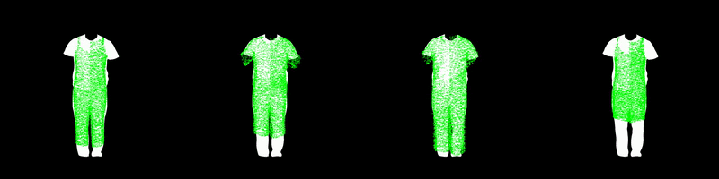
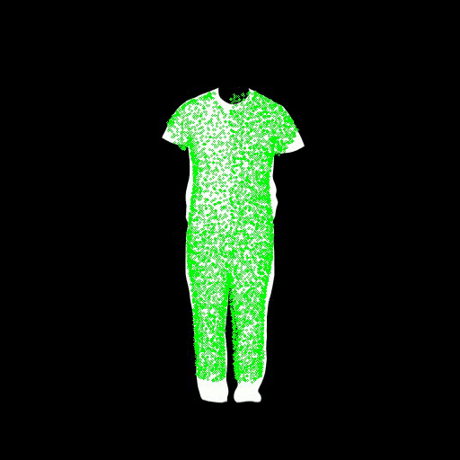
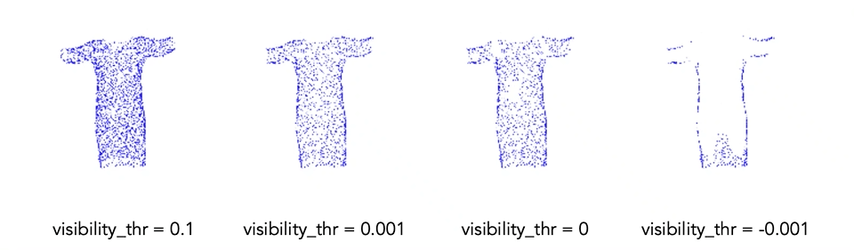
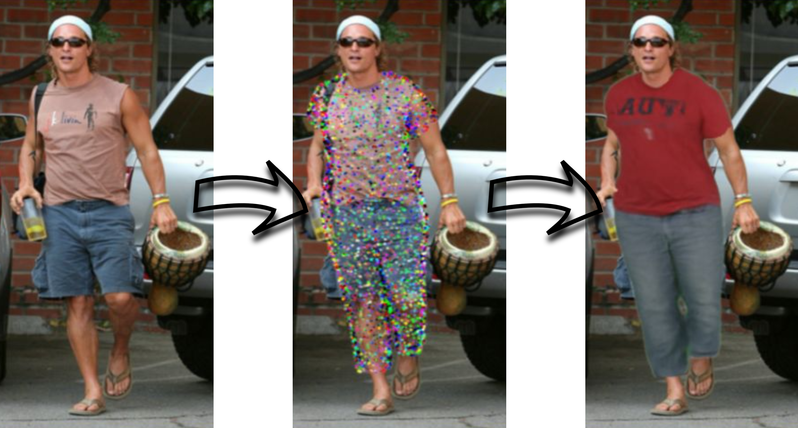

# Point-Based Modeling of Human Clothing

<p align="center">
  <b>
  <a href="https://openaccess.thecvf.com/content/ICCV2021/html/Zakharkin_Point-Based_Modeling_of_Human_Clothing_ICCV_2021_paper.html">Paper</a> 
  | <a href="https://www.ilia.ai/research/point-based-clothing">Project page</a>
  | <a href="https://youtu.be/kFrAu415kDU">Video</a>
    </b>
</p>

<p align="center"></p>

This is an official PyTorch code repository of the paper "Point-Based Modeling of Human Clothing" (accepted to ICCV, 2021).

## Setup

### Build docker

- Prerequisites: your nvidia driver should support cuda 10.2, Windows or Mac are not supported.
- Clone repo:
  - `git clone https://github.com/izakharkin/point_based_clothing.git`
  - `cd point_based_clothing`
  - `git submodule init && git submodule update`
- Docker setup:
  - [Install docker engine](https://docs.docker.com/engine/install/ubuntu/)
  - [Install nvidia-docker](https://docs.nvidia.com/datacenter/cloud-native/container-toolkit/install-guide.html)
  - [Set](https://docs.nvidia.com/datacenter/cloud-native/container-toolkit/user-guide.html#daemon-configuration-file) nvidia your default runtime for docker
  - Make docker run without sudo: create docker group and add current user to it: 
    ```
    sudo groupadd docker
    sudo usermod -aG docker $USER
    ```
  - **Reboot**
- Download [`10_nvidia.json`](https://gitlab.com/nvidia/container-images/opengl/-/blob/2dba242a538fdaa558c5f87017a7cf63eb016582/glvnd/runtime/10_nvidia.json) and place it in the `docker/` folder
- Create docker image: 
  - Build on your own: [run](./docker) 2 commands
- Inside the docker container: `source activate pbc`

## Download data

- Download the SMPL neutral model from [SMPLify project page](https://smplify.is.tue.mpg.de/login.php): 
  - Register, go to the `Downloads` section, download `SMPLIFY_CODE_V2.ZIP`, and unpack it;
  - Move `smplify_public/code/models/basicModel_neutral_lbs_10_207_0_v1.0.0.pkl` to `data/smpl_models/SMPL_NEUTRAL.pkl`.
- Download models checkpoints (~570 Mb): [Google Drive](https://drive.google.com/file/d/16QFuHhou_C4EY6GvKCgbJvgbkIycITHw/view?usp=sharing) and place them to the `checkpoints/` folder;
- Download a sample data we provide to check the appearance fitting (~480 Mb): [Google Drive](https://drive.google.com/file/d/13ma8J0-ah4sVn0uH_hYSoJ_GLMxFpoQa/view?usp=sharing), unpack it, and place `psp/` folder to the `samples/` folder.

## Run

We provide scripts for *geometry* fitting and inference and *appearance* fitting and inference.

### Geometry (outfit code)

#### Fitting

To fit a style outfit code to a single image one can run:
```
python fit_outfit_code.py --config_name=outfit_code/psp
```

The learned outfit codes are saved to `out/outfit_code/outfit_codes_<dset_name>.pkl` by default. The visualization of the process is in `out/outfit_code/vis_<dset_name>/`:

* Coarse fitting stage: four outfit codes initialized randomly and being optimized simultaneosly.

<p align="center">
  
</p>

* Fine fitting stage: mean of found outfit codes is being optimized further to possibly imrove the reconstruction.

<p align="center">
  
</p>

**Note:** `visibility_thr` hyperparameter in `fit_outfit_code.py` may affect the quality of result point cloud (e.f. make it more sparse). Feel free to tune it if the result seems not perfect.

<p align="center">
  
</p>

#### Inference

<p align="center">
  
</p>

To further infer the fitted outfit style on the train or on new subjects please see `infer_outfit_code.ipynb`. To run jupyter notebook server from the docker, run this inside the container:

```
jupyter notebook --ip=0.0.0.0 --port=8087 --no-browser 
```

### Appearance (neural descriptors)

#### Fitting

To fit a clothing appearance to a sequence of frames one can run:
```
python fit_appearance.py --config_name=appearance/psp_male-3-casual
```

The learned neural descriptors `ntex0_<epoch>.pth` and neural rendering network weights `model0_<epoch>.pth` are saved to `out/appearance/<dset_name>/<subject_id>/<experiment_dir>/checkpoints/` by default. The visualization of the process is in `out/appearance/<dset_name>/<subject_id>/<experiment_dir>/visuals/`.

#### Inference

<p align="center">
  
</p>

To further infer the fitted clothing point cloud and its appearance on the train or on new subjects please see `infer_appearance.ipynb`. To run jupyter notebook server from the docker, run this inside the container:

```
jupyter notebook --ip=0.0.0.0 --port=8087 --no-browser 
```

## Citation

If you find our work helpful, please do not hesitate to cite us:

```
@InProceedings{Zakharkin_2021_ICCV,
    author    = {Zakharkin, Ilya and Mazur, Kirill and Grigorev, Artur and Lempitsky, Victor},
    title     = {Point-Based Modeling of Human Clothing},
    booktitle = {Proceedings of the IEEE/CVF International Conference on Computer Vision (ICCV)},
    month     = {October},
    year      = {2021},
    pages     = {14718-14727}
}
```

Non-commercial use only.

## Related projects

- [Cloud Transformers](https://github.com/saic-vul/cloud_transformers)
- [Neural Point-Based Graphics](https://github.com/alievk/npbg)
- [Neural Textures](https://github.com/saic-vul/neural-textures) and [StylePeople](https://github.com/saic-vul/style-people)

We also thank the authors of [Cloth3D](https://competitions.codalab.org/competitions/24768#learn_the_details) and [PeopleSnapshot](https://github.com/thmoa/videoavatars) datasets.
